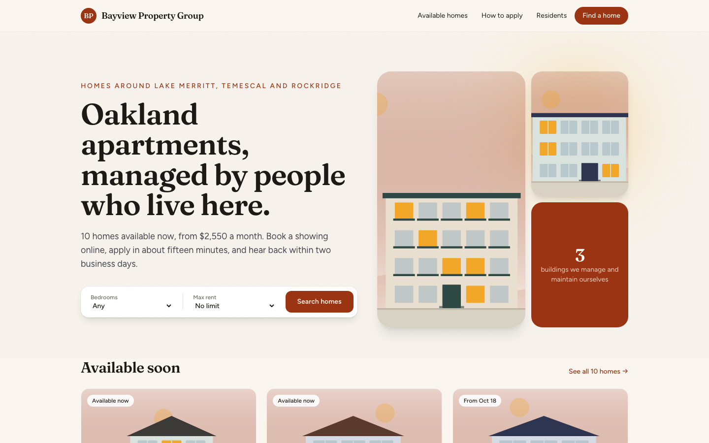
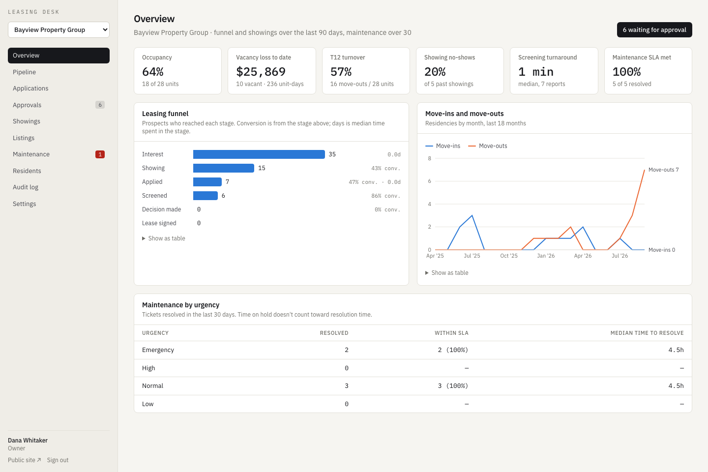
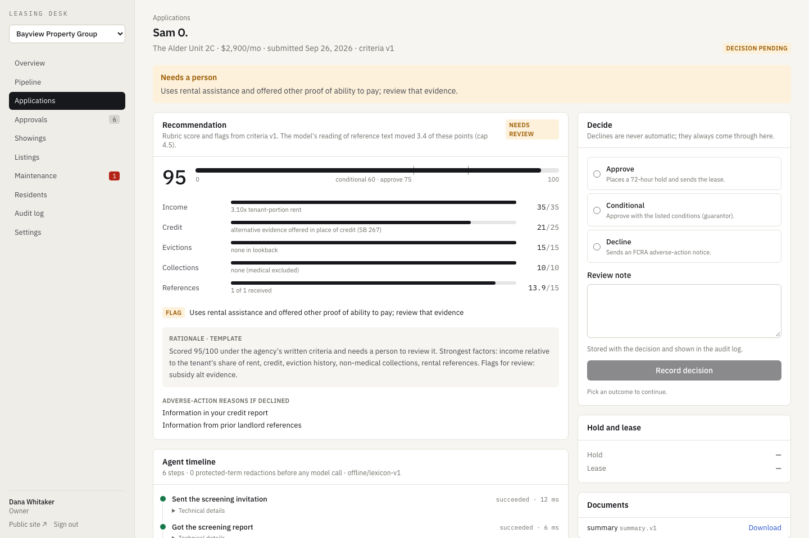
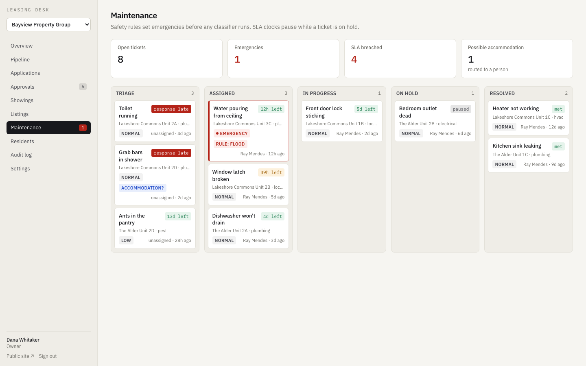
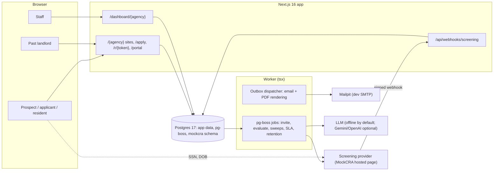

# Leasing Management

A leasing platform for small property-management agencies. Each agency gets a listing site where
prospects can book showings and apply. A screening agent scores applications against written
criteria and drafts paperwork. Residents can file maintenance requests. The agency chooses
how much the agent can do on its own.

The platform never sees an applicant's SSN or date of birth. The screening company collects
those on its own page. The platform keeps a derived summary and the report id.



## Background

In Krish's words:

> I ran a small AI retrofitting business for leasing agencies, aimed at cutting tenant turnover
> and raising NOI. I rebuilt the websites of agencies whose sites were out of date (listings
> and the application process) and gave them an application platform: prospective tenants send
> an indication of interest, schedule a showing, then submit an application. An agent grades the
> application (credit history, past landlord references) into a recommendation and fills in the
> rest of the paperwork. Each agency picks the automation level: let the agent do everything, or
> just take its suggestions. There was also a maintenance ticket system. Four Bay Area agencies
> used it at $250 a month. My biggest worry was the liability of storing sensitive
> background-check data.

This repository is a rebuilt, open version of that platform, written from scratch. It is not
the code those agencies ran. The two agencies in the demo (Bayview Property Group in Oakland and
Peninsula Homes in San Mateo) are fictional, and so is everyone in the seed data.

## What's in it

| Who | What they get |
|---|---|
| Prospects | Themed agency site at `/{agency}`, listing filters, "I'm interested" form, showing booking with an `.ics` invite and a reschedule/cancel link |
| Applicants | Magic-link sign-in, a five-step application that saves as you go, a status page, lease review and typed e-signature |
| Past landlords | A single-use reference form (tokenized link, no account) |
| Staff | Desk at `/dashboard/{agency}`: pipeline kanban, applications with the rubric and agent timeline, approvals queue, showings, listings, maintenance board with SLA clocks, residents, audit log, automation settings |
| Residents | Portal for repair requests with photos, and ticket updates by email |







## Architecture



The applicant enters their SSN and date of birth on the screening company's page. Those details
follow the dotted edge in the diagram and never pass through the platform.

See [the architecture section](#architecture), [the screening workflow](#the-screening-agent),
[liability and privacy](#liability-and-privacy), [limitations](#limitations), and the
[verification log](docs/verification.md).

## Quickstart (offline, no keys)

You need Node 22.12+, pnpm 10, and Docker.

```bash
make setup      # install locked deps + Chromium, pull images, write .env with fresh keys, migrate, build
make demo       # reset and seed the database, then run the web server (:3041) and the worker
```

Then open:

- http://localhost:3041/bayview and http://localhost:3041/peninsula (the two agency sites)
- http://localhost:3041/login for the staff desk
- http://localhost:8041 for Mailpit, where every email lands (sign-in links, references, invites, leases)

Demo staff accounts all use the password `demo-password-2026`:

| Account | Role |
|---|---|
| `owner@bayview.test` | Owner, Bayview (Assisted mode) |
| `agent@bayview.test` | Leasing agent, Bayview |
| `maintenance@bayview.test` | Maintenance, Bayview |
| `owner@peninsula.test` | Owner, Peninsula (Autonomous mode) |

`resident@bayview.test` is a seeded resident; sign in to `/bayview/portal` with a magic link.
Applicants sign in the same way from the Apply button on any listing.

The seed uses the app's services and offline model, producing audit log entries, agent timelines
and PDFs. Bayview's queue has seven applicants: a clean approval, a conditional approval, a
voucher holder on the SB 267 path, an eviction record, a decline draft, one still waiting on a
reference, and one whose
reference text has two protected-class phrases redacted before scoring. Peninsula has one
auto-approved and signed lease, one auto-approved lease out for signature, and one escalated
thin credit file.

LLM calls default to a deterministic offline provider. To use a real model, set
`LLM_PROVIDER=gemini` (or `openai`), the matching key, and optionally `LLM_MODEL`.

## How it works

### The screening agent

Submitting an application locks the agency's criteria version, records consents, emails the
landlord references and enqueues a job in one transaction. The worker then runs these
steps:

1. `screening.invite`: create the provider invitation. The applicant gets an email to finish
   screening on the provider's site.
2. `screening.fetchSummary`: after the provider's signed webhook, fetch the derived summary
   (credit band, eviction and collection counts, identity check).
3. `references.analyze`: redact each reference's free text, then score it (1 to 5 on payment,
   care of the unit, and lease compliance) with the LLM or the offline lexicon.
4. `rubric.evaluate`: the deterministic 100-point rubric.
5. `rationale.generate`: a short explanation. It explains the outcome and can't change it.
6. `policy.apply`: apply the agency's automation level.

| Factor | Points |
|---|---|
| Income against the tenant's share of rent (subsidies subtracted first) | 35 |
| Credit band (no score counts as neutral, 14 points) | 25 |
| Evictions in the last 5 years | 15 |
| Non-medical collections | 10 |
| Landlord references: structured answers 70%, model-read text 30% | 15 |

The model only feeds the 30% text share of the reference score, so it can move at most 4.5 of
100 points. The criteria schema rejects any version that would raise that share. A thin file,
subsidy with alternative evidence, eviction, unverified identity, data conflict, reference
concern, or a tripped output guard sends the case to a person. Otherwise the thresholds are 75
to approve and 60 for a conditional approval.

The three automation levels:

- **Manual**: the agent recommends and writes a summary PDF.
- **Assisted**: the agent drafts the decision and documents, and a person approves them.
- **Autonomous**: a clean approval above the agency's score threshold executes by itself,
  within a daily cap and a pause switch. Anything else escalates.

Declines never execute automatically in any mode. A property test checks that across the
input space. A decline or conditional approval produces an FCRA adverse-action notice.

### Retry safety

pg-boss delivers jobs at least once. A worker can die after an external side effect but before
committing its result. Postgres records the state needed to handle retries:

- **Durable steps.** Each step row is unique per application, criteria version and step. A
  retry of a finished step returns the stored output.
  - A new attempt claims the step with a fresh token and a lease that outlives the job's own
    timeout.
  - Every write the step makes is conditional on that claim.
  - A changed input is flagged instead of silently re-run.
- **Provider idempotency and reconciliation.** The screening request row, carrying an
  idempotency key, commits before the provider call. A retry first asks the provider whether it
  already knows that key. A test turns off the provider's own idempotency, crashes after the
  call, and checks there is still exactly one invitation.
- **Transactional outbox.** Decisions, emails and documents are written in one transaction with
  deterministic keys.
  - The SMTP transport (Mailpit) is at-least-once, and a test shows the duplicate.
  - The production transport (Resend) sends `Idempotency-Key`, and a retry outside its 24-hour
    window goes to review instead of resending.
- **Atomic cap and pause.** Both are re-checked under a row lock at execution time, and the
  daily cap is a conditional increment. The race test runs 7 approvals against a cap of 3, and
  exactly 3 execute.
- **Unit holds and signing.** Approval places a 72-hour hold. A database index allows one active
  hold per unit, and later approvals wait in FIFO order.
  - Signing locks the unit and lease rows. Replaying a successful signature returns the
    identical response.
  - An exclusion constraint on residencies stops two leases from overlapping on one unit.

### Liability and privacy

| Data | Where it lives | Protection | Kept |
|---|---|---|---|
| SSN, date of birth | Only on the screening provider's page | Never sent to us | n/a |
| Applicant name, phone, landlord contacts, reference text | Postgres `*Enc` columns | AES-256-GCM, bound to the record's agency, model, id and field | Declined or withdrawn: 730 days, then purged |
| Credit score and key factors | `ScreeningResult.creditScoreEnc` | Encrypted; used only for the adverse-action disclosure | 120 days after decision or closing |
| Credit band, counts, report id | `ScreeningResult` | Tenant-scoped | With the decision record |
| Audit log | `AuditLog` | Append-only (a trigger blocks UPDATE, DELETE, TRUNCATE); no PII in metadata | Kept |

The protected-class lexicon (FHA, FEHA/Unruh, criminal history) catches plurals, demonyms,
kinship words and stated ages. It redacts matches before text reaches a model and scans the
model's output the same way. The application never asks for protected-class data.

## Results

`results/tests.json` records these checks at the commit named in the file (see
`scripts/record-tests.sh`):

- Unit tests: rubric edges, fairness invariance, DST slot generation, crypto, redaction, policy,
  SLA clocks.
- Integration tests against Postgres 17 and Mailpit: every crash, race and cross-tenant case
  above.
- Playwright end to end, run with the whole stack (Next server, worker, browser) inside an
  egress-blocking sandbox. An egress canary in the web process and in the worker has to report
  every external connection failing. Run unsandboxed, the same canary has to connect, which
  shows the check is real.
  - The e2e suite also types an SSN into the provider page and asserts it never appears in any
    request body.

`results/live-smoke.json` records one live run of `gemini-3.5-flash-lite` on three references,
one rationale and three tickets. It found:

- The model's scores moved the rubric by at most one point compared with the offline lexicon.
- The redacted reference still produced a sensible score.
- Nothing tripped the output guard.
- Details and the run manifest are in [docs/verification.md](docs/verification.md).

## Limitations

- **Screening.** SmartMove isn't wired up; it needs a partner agreement. The adapter documents
  the mapping. MockCRA is a simulation.
- **Legal.** The California rules (SB 267, source of income, AB 12 deposits, medical and
  COVID-era debt, Oakland and Berkeley Fair Chance) are this project's reading, marked
  "verify with counsel". The lease and notices are samples. None of it is legal advice.
- **E-signature.** Typed-name e-signature with a certificate page, not DocuSign.
- **Email.** Only SMTP to Mailpit was exercised. The Resend transport is unit-tested against a
  fake HTTP server and has never sent real mail.
- **Tenant isolation** is enforced in the application (a scoped Prisma client, composite foreign
  keys, guarded raw SQL). Postgres row-level security would be the next layer and isn't built.
- **Better Auth tables.** `user.email` and the magic-link verification rows are plaintext;
  they're deleted by the retention purge along with the applicant.
- **Key rotation.** `pnpm pii:rotate` re-encrypts under the active key. Because the envelope
  names its key, the key id inside the AAD changes while the record binding stays the same.
  The blind-index key isn't rotatable yet.
- **CI.** The workflow hasn't run in GitHub Actions yet. The Linux offline e2e job's container
  (app, worker and browser on the compose network with no egress) was built and passed locally
  under Docker Desktop.
- **Seed data.** Dashboard metrics come from generated data. The funnel's time-in-stage is near
  zero because the seed creates prospects all at once.

## Development

```bash
make check                        # lint, typecheck, unit and integration tests
make e2e                          # Playwright, unsandboxed (canary must connect)
make e2e-offline                  # same suite with egress blocked for the whole stack (macOS)
pnpm pii:purge --dry-run          # preview the retention purge
```

On macOS, `make e2e-offline` wraps the web server, the worker and the browser in
`scripts/offline-run`: a sandbox-exec profile (`scripts/offline.sb`) that denies outbound
network except localhost. On Linux, CI runs the same suite in a container attached only to the
compose network, which has no route out (`Dockerfile.e2e`).

## Credits

Built with Next.js, Prisma, Better Auth, pg-boss, React-PDF, the AI SDK, Playwright and Vitest.
Building illustrations are generated SVGs.

## License

MIT
